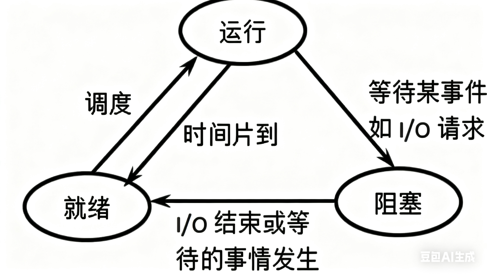

# 抽象进程状态

## 常见状态和状态转换的本质

1. 运行的本质：**进程连入到 CPU 的运行队列**
2. 阻塞的本质：**进程连入到外设的等待队列，CPU 不调度**
3. 状态转换的本质：就是将进程从一个队列弹出，插入到另一个队列。

## 挂起的原因和本质

本质：通过时间换空间。

方法：将进程数据**换出**到磁盘的**swap分区**中，用大量时间消耗（IO的时间消耗非常可怕）换取内存空间。注意，当该进程再次运行时，还要把磁盘中的数据再**换入**回内存中，又是一笔IO开销。

原因：内存资源严重不足，操作系统面临崩溃，为了保护操作系统的正常运行，从而出此下策。

闲聊：挂起**一般都是阻塞挂起**，阻塞状态的进程不被CPU调度，挂起相对安全。但是，当阻塞挂起依旧不能解决内存危机，操作系统还会做出**运行挂起**或直接**杀内存消耗巨大的进程（闪退）**来保障自身安全，即使这种行为非常危险。

# Linux 进程状态

1. R(running)：运行状态
2. S(sleeping)：阻塞状态（中断）
3. D(disk sleep)：阻塞状态（不可中断）
   
   disk: 磁盘

   和磁盘做IO的进程的数据（如银行流水）往往非常重要，不能被随意中断。

4. 